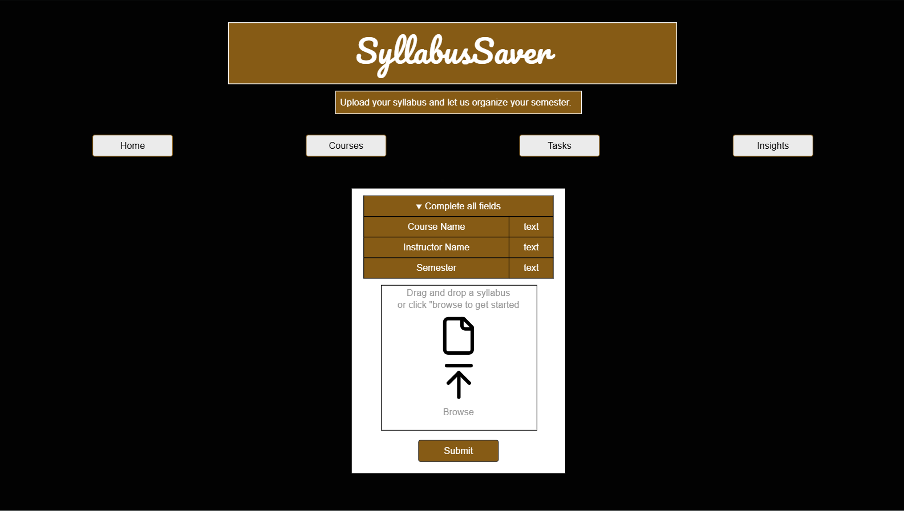

# CS408 Final Project SyllabusSaver

## Project Spec

### General Theme
SyllabusSaver is a web application designed to help students automatically organize their semester by uploading and analyzing their course syllabi. The general theme of the project is academic productivity through API-driven data mining. The site focuses on taking unstructured data from PDF syllabi and transforming it into an organized, accessible task list that includes key dates, assignments, and grading weights. It provides a simple and intuitive way for students to stay on top of their coursework without having to manually enter every due date or requirement.

The web app uses AWS services on the backend to extract and manage information. When a user uploads a syllabus file, the application processes it through AWS Textract to identify relevant pieces of text such as assignment names, deadlines, grading sections, and weight percentages. The extracted data is then analyzed by an AWS Lambda function, which parses it into structured fields and stores it in an AWS DynamoDB database. This information is displayed on the website through dynamically generated pages that the user can interact with. The site will be built entirely with raw HTML, CSS, and JavaScript, no frameworks, ensuring that every component is coded from scratch.

### What It Will Do
SyllabusSaver will allow students to upload syllabus PDFs and automatically extract key course data. The user interface will have four main pages:

* index.html – The landing page that introduces the app and contains the file upload form. Students can add a new course by uploading their syllabus and optionally entering the course name, instructor, and semester. Once uploaded, the file is sent to AWS S3 and triggers a Lambda function to begin text extraction.

* courses.html – This page lists all uploaded courses stored in the DynamoDB database. Students can filter courses by semester, instructor, or course name. Each course listing shows the extracted summary data such as the total number of assignments and the grading breakdown. Users can also delete courses they no longer need.

* tasks.html – This page displays all of the tasks and due dates extracted from syllabi. Students can filter tasks by course, due date range, or task type. Tasks can be edited or deleted, and updates are saved back to the AWS database.

* insights.html – This page visualizes data about the user’s workload. It displays charts and statistics such as which weeks are the busiest, what percentage of the final grade each category contributes, and how many assignments are upcoming. This helps students identify high-stress periods in the semester and plan accordingly.

The web app’s workflow is straightforward: upload a syllabus, view the parsed results, interact with your list of tasks, and visualize your schedule. It uses AWS on the backend, dynamically retrieves and displays data, allows CRUD operations, and will include 20 or more CSS styles across multiple pages.

### Target Audience
The target audience for SyllabusSaver is primarily college and university students who are enrolled in multiple courses per semester and often struggle to keep track of different deadlines and grading schemes. These users value organization, automation, and simplicity. Instead of having to copy dates from each syllabus into a planner, students can quickly upload all their course syllabi and get a unified view of their semester workload.

A secondary audience includes academic advisors or tutors who might use the tool to assist students in mapping out study schedules or detecting overlapping deadlines. It may also be useful for instructors who want to test whether their syllabus follows consistent formatting or evenly distributes work across a term.

### Data Management
SyllabusSaver will manage several types of dynamic data. This includes user-uploaded PDF syllabi, which are temporarily stored in an S3 bucket, and structured data extracted from those PDFs, which is stored permanently in DynamoDB. Each course will have metadata such as course name, instructor, and semester, while each task will have fields for task name, due date, category, and grade weight.

Users will also be able to edit or delete these entries, so the database will need to handle updates and deletions. Every time the user interacts with the app (adding a course, viewing tasks, filtering by date, or deleting entries), the frontend JavaScript will make API calls to AWS through the API Gateway, and Lambda will update the database accordingly.

The dynamic data includes:

* Uploaded PDF files

* Parsed text from syllabi (processed automatically)

* Course records (course name, instructor, semester)

* Task records (assignment name, due date, weight)

* Analytical summaries generated by the backend

### Stretch Goals
Once the core functionality is complete, several optional features could be added to make SyllabusSaver even more powerful:

* Calendar Export – Allow users to download all of their deadlines as an .ics file that can be imported into Google Calendar or Outlook.

* Cram Risk Predictor – Analyze how closely spaced tasks and exams are to determine which weeks are likely to be the most stressful.

* Conflict Heatmap – Display a visual calendar heatmap showing overlapping due dates across different courses.

* Grade Projection – Allow users to manually enter grades for each assignment and calculate projected course grades based on the syllabus weights.

### Summary
SyllabusSaver is a student-focused, full-stack web application that combines file upload, text extraction, data mining, and dynamic visualization to simplify semester planning. The site is built entirely from scratch using HTML, CSS, and JavaScript for the frontend, with AWS services (S3, Lambda, DynamoDB, and API Gateway) powering the backend. It manages meaningful user-generated data and fulfills all major requirements of the course project. Once finished, the app will provide students with an intelligent and efficient way to understand their workload and stay organized throughout the academic term.

## Project Wireframe

